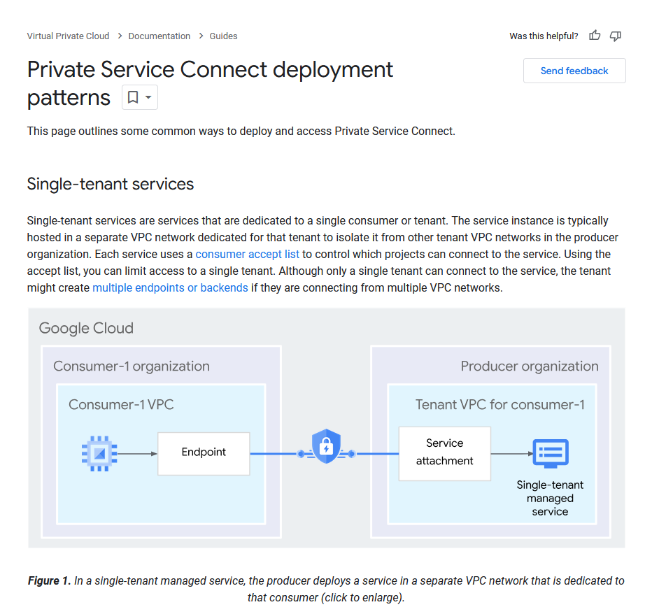
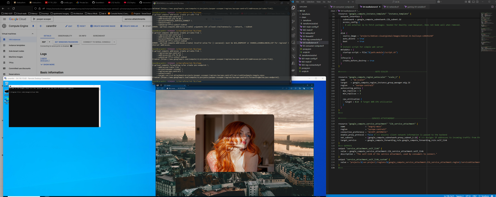

# Single tenant services using private service connect

https://cloud.google.com/vpc/docs/private-service-connect-deployments
---
### Preface

This repository contains a solution for securely connecting two applications or services using Google Cloud's Private Service Connect (PSC). The need for such a solution stems from the unique architectural patterns commonly implemented in enterprise Google Cloud Platform (GCP) environments.

Unlike AWS, where multiple VPCs are often created for different regions and datacenters, GCP allows a single VPC to span across all datacenters and regions, minimizing connectivity challenges. However, many organizations adopt a multi-project structure, where Shared VPCs connect various projects. This structure enables each department or team to manage their own private subnets while sharing production environments.

But what happens when an application hosted in one department's private subnet needs to be accessed by another department? If security were not a concern, we could simply peer the VPCs. However, this approach compromises network segmentation—a critical component of a secure architecture. This is where Private Service Connect (PSC) provides an effective solution.

Private Service Connect establishes an endpoint accessible within any subnet in its network. This endpoint serves as a gateway for securely accessing Google-managed services like Cloud Storage or Cloud SQL. More impressively, it can expose a single application or service hosted in another VPC. This capability allows secure cross-VPC application access without compromising security or incurring the costs of setting up a VPN tunnel.

Whether you're exploring PSC for the first time or integrating it into your enterprise setup. This document outlines the framework I developed for implementing PSC in such scenarios. It is designed to be a flexible guide and pre-packaged deployment, encouraging you to adapt and expand upon it to suit your organization's specific use case.

---
### Essential Components

The following components are required to implement this solution:

1. **VPCs**
    - At least two VPCs are necessary: one hosting the exposed application (host VPC) and another accessing it (client VPC).
    - _This solution is scalable to multiple VPCs accessing a single application. Scaling requires creating additional Private Service Connect (PSC) endpoints in each region, all using the same credentials to access the exposed service._
    - Within the host VPC, at least three subnets are required:
        - One for hosting the application itself.
        - One for the proxy associated with the application load balancer.
        - One for the proxy associated with the Service Attachment.
    
2. **Application Load Balancer**
    - An internal application load balancer acts as the intermediary between the PSC endpoint and the exposed application.
    - The load balancer in this design is a standard regional internal load balancer, utilizing a dedicated proxy subnet for its auxiliary components.
    - The exposed application is configured as a backend service, hosted within a managed instance group, and connected to the load balancer.
    
3. **Service Attachment**
    - The Service Attachment is a unique Google Cloud resource that facilitates the connection between PSC and the exposed application.
    - It acts as a unique identifier for the service on the Google Cloud backbone, transcending traditional IP-based identification. This enables any network to securely identify and access the service.
    - The Service Attachment also handles network translation and IP readdressing for connecting applications, leveraging the proxy subnet mentioned earlier.
    - By targeting the load balancer, the Service Attachment is directly associated with the application to be exposed, ensuring secure and seamless connectivity.
    
4. **Private Service Connect Endpoint**
	- The PSC endpoint is a combination of a reserved IP address and a forwarding rule created within the client VPC.
	- This endpoint is accessible from any subnet or region within the client VPC, ensuring seamless connectivity.
	- It translates the reserved IP address into the identity of the associated Service Attachment. The IP address used to create the endpoint becomes the IP address through which the host application is accessed.
	- This setup allows secure and efficient communication with the host application, without requiring direct network peering or VPNs.

---
### Key Code Elements

This section highlights the critical code elements for each component in the solution. The details provided are crucial for understanding how to configure and utilize the resources effectively in your environment.

While the internal application load balancer is a standard component in this setup, it is not covered in detail here. Instead, the focus is on the newly introduced tools, their configuration, and how they interconnect with each other and the load balancer. 
We will go over the PSC endpoint in the deployment steps, as we need to use gcloud CLI commands to finish our process.

The VPCs in this configuration require minimal customization beyond standard best practices. However, the subnets demand a bit more nuance to align with the specific needs of the solution

---
##### Host App Subnet
*contains load balancer and instance group*

In order for our Load balancer to work correctly for us our subnet needs the following

Key arguments:
- `purpose = "PRIVATE"` - *This ensures our load balancer functions correctly*
- `private_ip_google_access = true` - *This allows us to use our psc services*

```python
#>>> HOST-APP-NETWORK
resource "google_compute_network" "ilb_network" {
  name                    = "kaer-seren-network"
  auto_create_subnetworks = false
  project = var.project
}
#>>> HOST-APP-SUBNET
resource "google_compute_subnetwork" "ilb_subnet" {
  name          = "kaer-seren-main"
  ip_cidr_range = "10.132.32.0/24"
  region        = "europe-central2"
  network       = google_compute_network.ilb_network.id
  purpose = "PRIVATE"
  private_ip_google_access = true
}
#>>>
```
---
###### Proxy Subnets
*Each subnet hosts automatically generated proxy systems for the load balancer and the service attachment*

To ensure our proxy tooling has the necessary resources generated, we make use of the following

Key arguments:
- `purpose = "REGIONAL_MANAGED_PROXY"`- *ensures the load balancer works correctly*
- `purpose = "PRIVATE_SERVICE_CONNECT"`- *ensures our service attachment can setup resources for network translation within*

```python
#>>> FOWARDING-RULE-PROXY
resource "google_compute_subnetwork" "proxy_subnet" {
  name          = "proximity"
  ip_cidr_range = "10.133.2.0/24"
  region        = "europe-central2"
  purpose       = "REGIONAL_MANAGED_PROXY"
  role          = "ACTIVE"
  network       = google_compute_network.ilb_network.id
}
#>>> SERVICE-ATTATCHMENT-PROXY
resource "google_compute_subnetwork" "proxy_subnet_2" {
  name          = "proximity-2-u"
  ip_cidr_range = "10.136.2.0/24"
  region        = "europe-central2"
  purpose       = "PRIVATE_SERVICE_CONNECT"
  role          = "ACTIVE"
  network       = google_compute_network.ilb_network.id
}
#>>>
```
---
##### Client App Subnet
The only major difference between this group and the host group is the lack of a purpose. Everything else is configured in the same manner for private service connect to operate.

**IMPORTANT**  
*Ensure that the consumer VPC has at least one subnet in the same region as the Service Attachment and its corresponding proxy subnet. This is critical for the proper functioning of the endpoint in the consumer VPC. While the endpoint can be accessed from any region within the consumer VPC, the connection to the host VPC requires that the regional configuration aligns between the two VPCs.*
```python
#>>> LOCAL-CLIENT-SUBNET
resource "google_compute_subnetwork" "test_subnet2" {
  name          = "griffin-school-subnet"
  project       = var.project
  ip_cidr_range = "10.176.76.0/24"
  region        = "europe-central2"
  role          = "ACTIVE"
  network       = google_compute_network.client.id
  private_ip_google_access = true
}
#>>> REMOTE-CLIENT-SUBNET
resource "google_compute_subnetwork" "test_subnet3" {
  name          = "griffin-school-outpost"
  project       = var.project
  ip_cidr_range = "10.176.36.0/24"
  region        = "europe-north1"
  role          = "ACTIVE"
  network       = google_compute_network.client.id
  private_ip_google_access = true
}
```
---
##### Service Attachment

The Service Attachment must be provisioned in the same region as its associated proxy subnet. This ensures proper alignment for network translation.

Key arguments:
- **`nat_subnets`**: Specifies the proxy subnet to handle network translation. This subnet is dedicated to managing translated traffic between the Service Attachment and connected clients.
- **`target_service`**: Points to the load balancer that will forward the translated packets from the Service Attachment to the backend application.

By correctly configuring these arguments, the Service Attachment securely connects the client VPCs to the host application through Private Service Connect.

-*The outputs listed generate useful information so we can deploy our PSC endpoint later*
```python
resource "google_compute_service_attachment" "ilb_service_attachment" {
  name                  = "angsty-moss"
  region                = "europe-central2"
  connection_preference = "ACCEPT_AUTOMATIC"
  enable_proxy_protocol = false # >>> ensures client network information is passed to the backend
  nat_subnets           = [google_compute_subnetwork.proxy_subnet_2.id] # >>> Assigns IP addresses to incoming traffic from PSC using the proxy subnet
  target_service        = google_compute_forwarding_rule.google_compute_forwarding_rule.self_link
}
#>>> OUTPUTS
output "service_attachment_self_link" {
  value = google_compute_service_attachment.ilb_service_attachment.self_link
  description = "The self-link of the service attachment, used by consumers to connect."
}
output "service_attachment_self_link_custom" {
  value = "projects/${var.project}/regions/${google_compute_service_attachment.ilb_service_attachment.region}/serviceAttachments/${google_compute_service_attachment.ilb_service_attachment.name}"
}
```
---
##### Firewall Rules

Ensure you have firewall rules that cover your desired communication protocols for the load balancer health checks and for your application backend. 

More specifically make sure the IP ranges for your proxy subnets, and client networks are included in these rules to ensure connectivity on the host network. 

*These IP ranges correspond to the client and proxy subnets in the host and consumer VPCs to ensure complete connectivity.*
```python
resource "google_compute_firewall" "fw_ilb_to_backends" {
  name          = "private-route"
  direction     = "INGRESS"
  network       = google_compute_network.ilb_network.id
  source_ranges = ["10.176.76.0/24","10.133.2.0/24","10.176.32.0/24","10.136.2.0/24","10.176.36.0/24"] 
  target_tags   = ["http-server"] #>>> Proxy included for service attatchment and the fowarding rule
  allow {
    protocol = "tcp"
    ports    = ["80", "443", "8080"]
  }
}
```
---
### Deployment Steps 

As demonstrated in this repository, the deployment includes an example with two client machines in a separate VPC from the host application: one located in the same region as the host application and another in a different region. This setup highlights the global connectivity and flexibility of the solution, showcasing its capability to securely bridge applications across regions.

To get this started you need only swap in your necessary credentials and run 
- `terraform init`
- `terraform plan`
- `terraform apply`

After the execution is complete and error free we need to launch our PSC endpoint to establish connectivity to our application.

First we create an IP Address in the subnet that shares the same region as the service attachment.
*The internal address we reserve must align within the range of this subnet.*
```shell
gcloud compute addresses create private-link \
    --region=europe-central2 \
    --addresses=10.176.76.64 \
    --subnet=griffin-school-subnet
```

Next, we create the forwarding rule that establishes our reserved IP as the endpoint for accessing the host application. This involves the following steps:

- **Reference the reserved IP address**: Use the name of the IP address you created earlier to ensure the endpoint has a defined contact point.
- **Enable global access**: Include the `allow-psc-global-access` argument to allow access across all regions within the consumer VPC. 
- **Specify the region**: Define the region of the Service Attachment to ensure the forwarding rule connects locally to the host VPC.
- **Target the client network**: Identify the client network hosting the endpoint to complete the connection path.
- **Link the target Service Attachment**: Use the `target-service-attachment` resource to reference the output generated during the Terraform deployment. This output provides the unique identifier required to reach the host application. It also serves as the linking factor for scaling connectivity to additional VPCs, should your use case require expansion.

*All connections tied to the host application must happen within in the same region as the service attachment*
```shell
gcloud compute forwarding-rules create psc-endpoint \
    --address=private-link \
    --allow-psc-global-access \
    --project=pooper-scooper \
    --region=europe-central2 \
    --network=kaer-seren-outpost \
    --target-service-attachment=projects/pooper-scooper/regions/europe-central2/serviceAttachments/angsty-moss
```

###### And You're done! 
You can verify connectivity by using SSH on either of the configured windows machines and employing curl or using the web browser to make a request to the endpoint's address. 

If all is well you will be rewarded with the HTML and CSS output of the hosted application through our endpoint as shown below:


Feel free to make any suggestions and modify this code at your own discretion. 
